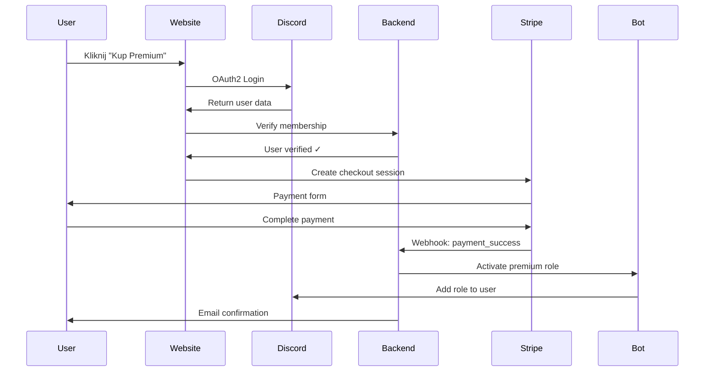

# Platforma E-commerce dla zgdk - Koncepcja

## 🎯 Wizja
Kompletny ekosystem składający się z:
1. **Discord Bot** (zgdk) - obecny
2. **Strona E-commerce** - sprzedaż rang premium przez Stripe
3. **Admin Dashboard** - zarządzanie całością (inspirowany Twenty CRM)

## 🏗️ Architektura Zintegrowana

```
┌─────────────────────────────────────────────────────────────┐
│                     Użytkownicy                             │
└────────────┬─────────────────────┬─────────────────────────┘
             │                     │
    ┌────────▼────────┐   ┌───────▼────────┐
    │ Strona Sklepu  │   │  Discord Bot   │
    │   (Next.js)    │   │   (Python)     │
    └────────┬────────┘   └───────┬────────┘
             │                     │
    ┌────────▼─────────────────────▼────────┐
    │          Wspólne Backend API          │
    │            (FastAPI/NestJS)           │
    └────────┬──────────────────────────────┘
             │
    ┌────────▼────────┐   ┌─────────────────┐
    │  PostgreSQL DB  │   │  Redis Cache    │
    └─────────────────┘   └─────────────────┘
             │
    ┌────────▼────────┐
    │ Admin Dashboard │
    │  (React/Twenty) │
    └─────────────────┘
```

## 💳 Strona E-commerce

### Główne Funkcje

#### 1. Landing Page
```
[Hero Section]
zaGadka Premium
Odblokuj pełny potencjał swojego serwera Discord

[Rangi Premium]
┌─────────────┐ ┌─────────────┐ ┌─────────────┐ ┌─────────────┐
│    zG50     │ │    zG100    │ │    zG500    │ │   zG1000    │
│             │ │             │ │ POPULARNY   │ │   PREMIUM   │
│  19 zł/mies │ │  35 zł/mies│ │ 149 zł/mies│ │ 279 zł/mies │
│             │ │             │ │             │ │             │
│ ✓ Feature 1 │ │ ✓ Feature 1 │ │ ✓ Feature 1 │ │ ✓ Feature 1 │
│ ✓ Feature 2 │ │ ✓ Feature 2 │ │ ✓ Feature 2 │ │ ✓ Feature 2 │
│             │ │ ✓ Feature 3 │ │ ✓ Feature 3 │ │ ✓ Feature 3 │
│             │ │             │ │ ✓ Feature 4 │ │ ✓ Feature 4 │
│             │ │             │ │ ✓ Feature 5 │ │ ✓ Feature 5 │
│             │ │             │ │             │ │ ✓ Feature 6 │
│             │ │             │ │             │ │ ✓ Feature 7 │
│  [KUP TERAZ]│ │  [KUP TERAZ]│ │  [KUP TERAZ]│ │  [KUP TERAZ]│
└─────────────┘ └─────────────┘ └─────────────┘ └─────────────┘
```

#### 2. Proces Zakupu

##### Krok 1: Autoryzacja Discord
```javascript
// OAuth2 flow
const DISCORD_OAUTH_URL = `https://discord.com/api/oauth2/authorize?
  client_id=${CLIENT_ID}&
  redirect_uri=${REDIRECT_URI}&
  response_type=code&
  scope=identify+guilds`;
```

##### Krok 2: Weryfikacja Członkostwa
- Sprawdzenie czy użytkownik jest na serwerze zaGadka
- Pobranie aktualnych rang i statusu premium

##### Krok 3: Wybór Planu
- Miesięczny / Kwartalny / Roczny (ze zniżkami)
- Upgrade z obecnego planu (proporcjonalny przelicznik)

##### Krok 4: Płatność Stripe
```javascript
// Stripe Checkout Session
const session = await stripe.checkout.sessions.create({
  payment_method_types: ['card', 'blik', 'p24'],
  line_items: [{
    price: 'price_zG500_monthly',
    quantity: 1,
  }],
  mode: 'subscription',
  success_url: `${DOMAIN}/success?session_id={CHECKOUT_SESSION_ID}`,
  cancel_url: `${DOMAIN}/cancel`,
  metadata: {
    discord_id: user.id,
    discord_username: user.username,
    premium_tier: 'zG500'
  }
});
```

##### Krok 5: Automatyczna Aktywacja
- Webhook Stripe → Backend API → Discord Bot
- Natychmiastowe nadanie rangi
- Email z potwierdzeniem

### 3. Panel Użytkownika

#### Moje Konto
- **Status Premium**: Aktywny/Nieaktywny
- **Typ Subskrypcji**: zG50/100/500/1000
- **Data Odnowienia**: DD/MM/YYYY
- **Historia Płatności**: Lista transakcji
- **Zarządzanie Subskrypcją**:
  - Anuluj subskrypcję
  - Zmień plan
  - Zaktualizuj metodę płatności

### 4. Integracja ze Stripe

#### Webhooks
```python
# FastAPI endpoint
@app.post("/stripe/webhook")
async def stripe_webhook(request: Request):
    payload = await request.body()
    sig_header = request.headers.get('stripe-signature')
    
    event = stripe.Webhook.construct_event(
        payload, sig_header, webhook_secret
    )
    
    if event['type'] == 'checkout.session.completed':
        await activate_premium(event['data']['object'])
    elif event['type'] == 'customer.subscription.updated':
        await update_premium(event['data']['object'])
    elif event['type'] == 'customer.subscription.deleted':
        await cancel_premium(event['data']['object'])
```

#### Obsługiwane Metody Płatności
- **Karty**: Visa, Mastercard, American Express
- **BLIK**: Popularne w Polsce
- **Przelewy24**: Polski procesor płatności
- **Google Pay / Apple Pay**

### 5. Bezpieczeństwo

- **PCI Compliance**: Stripe Checkout (nie przechowujemy danych kart)
- **HTTPS**: Obowiązkowe dla całej strony
- **CSRF Protection**: Tokeny dla wszystkich formularzy
- **Rate Limiting**: Ochrona przed nadużyciami
- **Webhook Verification**: Podpisy Stripe

## 🔄 Flow Integracji

### Zakup Premium (Happy Path)


### Odnowienie Subskrypcji
- Automatyczne przez Stripe
- Webhook → Backend → Bot updates role expiration
- Email z przypomnieniem 3 dni przed

### Anulowanie Subskrypcji
- User panel → Cancel subscription
- Stripe cancels at period end
- Role expires naturally in bot

## 📊 Rozszerzony Admin Dashboard

### Nowe Sekcje dla E-commerce

#### 1. Przegląd Sprzedaży
- **Live Sales Feed**: Nowe zakupy w czasie rzeczywistym
- **Konwersja**: Odwiedzający → Płacący
- **Cart Abandonment**: Porzucone koszyki
- **A/B Testing**: Wyniki testów cenowych

#### 2. Zarządzanie Produktami
- **Plany Premium**: Edycja cen, features, opisów
- **Promocje**: Kody rabatowe, czasowe zniżki
- **Bundlee**: Pakiety (np. 3 miesiące = -10%)

#### 3. Integracja Stripe
- **Dashboard Stripe**: Embedded w admin panel
- **Refundy**: Obsługa zwrotów
- **Disputes**: Zarządzanie reklamacjami
- **Faktury**: Automatyczne generowanie

#### 4. Marketing
- **Email Campaigns**: Integracja z SendGrid/Mailgun
- **Analytics**: Google Analytics, Mixpanel
- **SEO**: Meta tagi, sitemap
- **Affiliate Program**: Tracking referrals

## 🚀 Implementacja Fazowa

### Faza 1: MVP Sklepu (4-6 tygodni)
- [ ] Setup Next.js z TypeScript
- [ ] Integracja Discord OAuth2
- [ ] Podstawowa integracja Stripe
- [ ] Prosty checkout flow
- [ ] Webhook handling

### Faza 2: Panel Użytkownika (2-3 tygodnie)
- [ ] Dashboard użytkownika
- [ ] Zarządzanie subskrypcją
- [ ] Historia płatności
- [ ] Faktury PDF

### Faza 3: Pełna Integracja (3-4 tygodnie)
- [ ] Rozbudowa Admin Dashboard
- [ ] Automatyzacja emaili
- [ ] System promocji/kuponów
- [ ] A/B testing

### Faza 4: Optymalizacja (ongoing)
- [ ] Performance optimization
- [ ] SEO improvements
- [ ] Conversion rate optimization
- [ ] Rozszerzenie metod płatności

## 💰 Model Biznesowy

### Struktura Cenowa
```
zG50:  19 zł/mies (228 zł/rok - save 0%)
zG100: 35 zł/mies (378 zł/rok - save 10%)
zG500: 149 zł/mies (1490 zł/rok - save 15%)
zG1000: 279 zł/mies (2790 zł/rok - save 20%)
```

### Przewidywane KPI
- **Conversion Rate**: 2-5% odwiedzających
- **Churn Rate**: 5-10% miesięcznie
- **LTV**: 6-12 miesięcy średnio
- **CAC**: < 50 zł per customer

## 🛠️ Stack Technologiczny

### Frontend (Sklep)
```javascript
// package.json
{
  "dependencies": {
    "next": "^14.0.0",
    "react": "^18.2.0",
    "typescript": "^5.3.0",
    "@stripe/stripe-js": "^2.2.0",
    "next-auth": "^4.24.0",  // Discord OAuth
    "tailwindcss": "^3.4.0",
    "framer-motion": "^10.16.0",  // Animacje
    "react-hot-toast": "^2.4.0"   // Notyfikacje
  }
}
```

### Backend (Wspólny)
```python
# requirements.txt
fastapi==0.104.1
stripe==7.8.0
authlib==1.3.0  # Discord OAuth
sqlalchemy==2.0.15
alembic==1.13.0  # Migracje DB
celery==5.3.4  # Background tasks
redis==5.0.1
pydantic==2.5.0
python-dotenv==1.0.0
```

### Infrastructure
- **Hosting**: Vercel (frontend) + Railway/Render (backend)
- **Database**: PostgreSQL (Supabase/Neon)
- **Cache**: Redis (Upstash)
- **CDN**: Cloudflare
- **Monitoring**: Sentry + LogRocket

## 📈 Zalety Całego Ekosystemu

1. **Automatyzacja**: 
   - Zero manual work przy zakupach
   - Automatyczne przedłużenia
   - Instant activation

2. **User Experience**:
   - Prosty proces zakupu
   - Self-service panel
   - Natychmiastowa aktywacja

3. **Business Intelligence**:
   - Pełne dane o klientach
   - Predykcja churn
   - Optymalizacja cennika

4. **Skalowalność**:
   - Obsługa tysięcy transakcji
   - Multi-server support
   - Global payment methods

## 🎯 Dlaczego Twenty CRM jest relevantne?

1. **UI/UX Patterns**: Świetne wzorce dla admin dashboard
2. **Data Management**: Sposób wyświetlania i filtrowania danych
3. **Architecture**: Clean architecture z API-first approach
4. **Extensibility**: Łatwe dodawanie nowych features

Twenty CRM + własne rozwiązania = **Kompletna platforma e-commerce dla Discord botów**