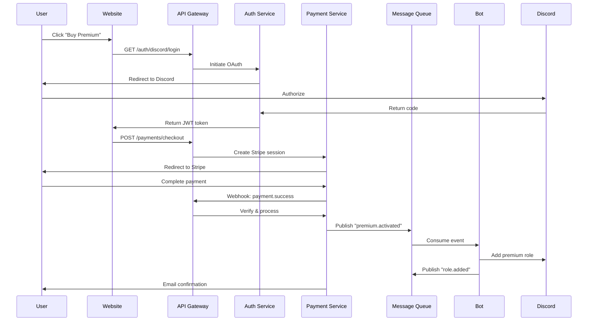
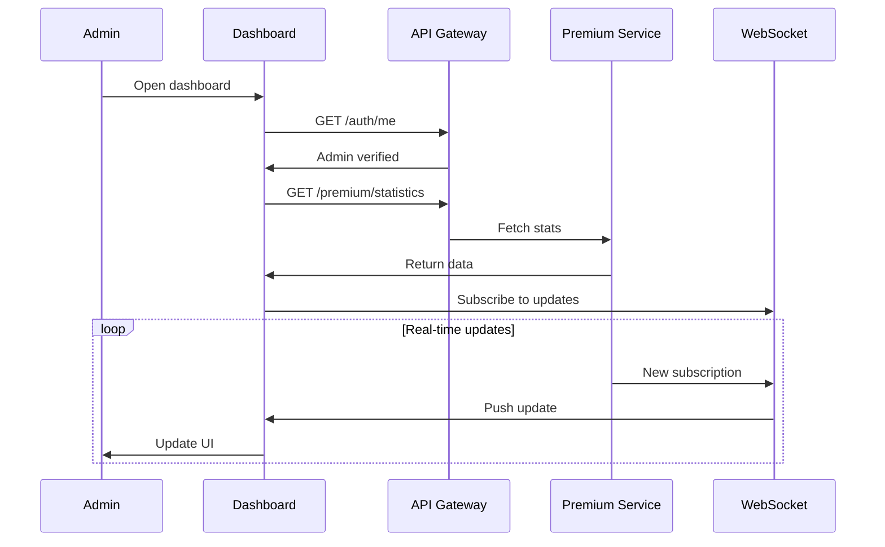

# Architektura Zintegrowana: Bot + E-commerce + Admin Panel

## 🎯 Cel
Stworzenie spójnego ekosystemu, gdzie wszystkie komponenty współdzielą dane i logikę biznesową.

## 🏗️ Architektura Mikrousługowa

```
┌─────────────────────────────────────────────────────────────────┐
│                         Load Balancer                           │
│                         (Cloudflare)                            │
└───────┬──────────────────┬──────────────────┬──────────────────┘
        │                  │                  │
┌───────▼────────┐ ┌──────▼───────┐ ┌───────▼────────┐
│   E-commerce   │ │ Admin Panel  │ │  Public API    │
│   (Next.js)    │ │   (React)    │ │   (FastAPI)    │
│ shop.zagadka.pl│ │admin.zagadka │ │api.zagadka.pl  │
└───────┬────────┘ └──────┬───────┘ └───────┬────────┘
        └──────────────────┴──────────────────┘
                           │
                  ┌────────▼────────┐
                  │   API Gateway   │
                  │   (Kong/Nginx)  │
                  └────────┬────────┘
                           │
        ┌──────────────────┼──────────────────┐
        │                  │                  │
┌───────▼────────┐ ┌──────▼───────┐ ┌───────▼────────┐
│ Auth Service   │ │Premium Service│ │Payment Service │
│  (FastAPI)     │ │  (FastAPI)    │ │   (FastAPI)    │
└───────┬────────┘ └──────┬───────┘ └───────┬────────┘
        │                  │                  │
        └──────────────────┼──────────────────┘
                           │
                  ┌────────▼────────┐
                  │  Message Queue  │
                  │  (RabbitMQ)     │
                  └────────┬────────┘
                           │
                  ┌────────▼────────┐
                  │  Discord Bot    │
                  │   (Python)      │
                  └────────┬────────┘
                           │
        ┌──────────────────┼──────────────────┐
        │                  │                  │
┌───────▼────────┐ ┌──────▼───────┐ ┌───────▼────────┐
│  PostgreSQL    │ │    Redis      │ │  File Storage  │
│   (Primary)    │ │   (Cache)     │ │     (S3)       │
└────────────────┘ └───────────────┘ └────────────────┘
```

## 🔧 Komponenty Systemu

### 1. API Gateway
**Technologia**: Kong lub Nginx
**Funkcje**:
- Routing do odpowiednich serwisów
- Rate limiting
- Authentication/Authorization
- Request/Response transformation
- Monitoring i analytics

### 2. Auth Service
**Odpowiedzialności**:
- Discord OAuth2
- JWT token management
- Session handling
- Permission management

**Endpoints**:
```
POST   /auth/discord/login
POST   /auth/discord/callback
POST   /auth/refresh
POST   /auth/logout
GET    /auth/me
```

### 3. Premium Service
**Odpowiedzialności**:
- Zarządzanie subskrypcjami
- Weryfikacja uprawnień
- Statystyki premium

**Endpoints**:
```
GET    /premium/status/{discord_id}
POST   /premium/activate
PUT    /premium/upgrade
DELETE /premium/cancel
GET    /premium/statistics
```

### 4. Payment Service
**Odpowiedzialności**:
- Integracja ze Stripe
- Obsługa webhooks
- Generowanie faktur
- Historia transakcji

**Endpoints**:
```
POST   /payments/checkout
POST   /payments/stripe/webhook
GET    /payments/history/{discord_id}
GET    /payments/invoices/{payment_id}
POST   /payments/refund
```

### 5. Message Queue
**Technologia**: RabbitMQ lub Redis Pub/Sub
**Kolejki**:
```
premium.activated    → Bot nadaje rolę
premium.expired      → Bot odbiera rolę
premium.reminder     → Bot wysyła DM
payment.completed    → Email confirmation
payment.failed       → Alert admins
```

## 📦 Shared Libraries

### Python (dla Bot + Services)
```python
# zgdk-common/setup.py
setup(
    name='zgdk-common',
    packages=[
        'zgdk_common.models',      # SQLAlchemy models
        'zgdk_common.schemas',     # Pydantic schemas
        'zgdk_common.utils',       # Shared utilities
        'zgdk_common.events',      # Event definitions
        'zgdk_common.exceptions',  # Custom exceptions
    ]
)
```

### TypeScript (dla Frontend)
```typescript
// @zgdk/shared/package.json
{
  "name": "@zgdk/shared",
  "exports": {
    "./types": "./src/types/index.ts",
    "./api": "./src/api/client.ts",
    "./utils": "./src/utils/index.ts",
    "./constants": "./src/constants/index.ts"
  }
}
```

## 🔄 Workflows

### Zakup Premium przez Stronę


### Admin Dashboard - Monitoring


## 🔐 Bezpieczeństwo

### 1. API Security
- **JWT Tokens**: Short-lived (15min) z refresh tokens
- **API Keys**: Dla service-to-service communication
- **HMAC Signatures**: Dla webhooks (Stripe, Discord)
- **Rate Limiting**: Per IP i per user

### 2. Database Security
- **Encryption at rest**: Dla sensitive data
- **Row Level Security**: PostgreSQL RLS
- **Audit logs**: Wszystkie zmiany premium/payments
- **Backups**: Automated daily z retention 30 dni

### 3. Infrastructure Security
- **VPC**: Izolacja sieciowa
- **Secrets Management**: Vault lub AWS Secrets Manager
- **TLS everywhere**: Wewnętrzna komunikacja też encrypted
- **WAF**: Cloudflare lub AWS WAF

## 📊 Monitoring i Observability

### 1. Metrics (Prometheus + Grafana)
```yaml
# Kluczowe metryki
- premium_subscriptions_active
- premium_subscriptions_new_daily
- payment_success_rate
- api_request_duration_seconds
- bot_command_execution_time
- database_connection_pool_usage
```

### 2. Logging (ELK Stack)
```json
{
  "timestamp": "2024-01-15T10:30:00Z",
  "service": "payment-service",
  "level": "info",
  "correlation_id": "abc-123",
  "user_id": "123456789",
  "action": "premium.activated",
  "metadata": {
    "tier": "zG500",
    "duration_days": 30
  }
}
```

### 3. Tracing (Jaeger)
- Distributed tracing across services
- Bottleneck identification
- Error propagation tracking

## 🚀 Deployment

### Development
```yaml
# docker-compose.yml
version: '3.8'
services:
  postgres:
    image: postgres:15
  redis:
    image: redis:7
  rabbitmq:
    image: rabbitmq:3-management
  
  auth-service:
    build: ./services/auth
    env_file: .env.dev
  
  premium-service:
    build: ./services/premium
    env_file: .env.dev
  
  bot:
    build: ./bot
    env_file: .env.dev
```

### Production (Kubernetes)
```yaml
# k8s/deployment.yaml
apiVersion: apps/v1
kind: Deployment
metadata:
  name: premium-service
spec:
  replicas: 3
  strategy:
    type: RollingUpdate
  template:
    spec:
      containers:
      - name: premium-service
        image: zgdk/premium-service:latest
        resources:
          requests:
            memory: "256Mi"
            cpu: "250m"
          limits:
            memory: "512Mi"
            cpu: "500m"
```

## 📈 Skalowanie

### Horizontal Scaling
- **Services**: Auto-scaling based on CPU/memory
- **Database**: Read replicas dla read-heavy operations
- **Cache**: Redis Cluster dla wysokiej dostępności

### Vertical Scaling
- **Initial**: 2 vCPU, 4GB RAM per service
- **Growth**: Monitor i scale based on metrics
- **Database**: Start z db.t3.medium, scale w razie potrzeby

## 💰 Koszty (Szacunkowe)

### Początkowe (100-1000 użytkowników)
- **Hosting**: ~$200/miesiąc (Kubernetes cluster)
- **Database**: ~$50/miesiąc (Managed PostgreSQL)
- **Stripe**: 2.9% + 1.20 PLN per transakcja
- **Cloudflare**: Free tier wystarczy

### Przy skali (10k+ użytkowników)
- **Hosting**: ~$1000/miesiąc
- **Database**: ~$300/miesiąc
- **CDN/DDoS**: ~$200/miesiąc
- **Monitoring**: ~$100/miesiąc

## 🎯 Korzyści Architektury

1. **Skalowalność**: Każdy serwis niezależnie
2. **Maintainability**: Separation of concerns
3. **Reliability**: Failure isolation
4. **Flexibility**: Łatwe dodawanie features
5. **Performance**: Optimized dla każdego use case

## 🔄 Migration Path

### Faza 1: Monolith First (2-3 miesiące)
- Wszystko w jednym FastAPI app
- Fokus na business logic
- Quick time to market

### Faza 2: Extract Services (3-6 miesięcy)
- Wydzielenie Auth Service
- Wydzielenie Payment Service
- API Gateway introduction

### Faza 3: Full Microservices (6+ miesięcy)
- Kubernetes deployment
- Service mesh (Istio)
- Advanced monitoring

Ta architektura pozwala rozpocząć od prostego rozwiązania i ewoluować wraz z rosnącymi potrzebami.